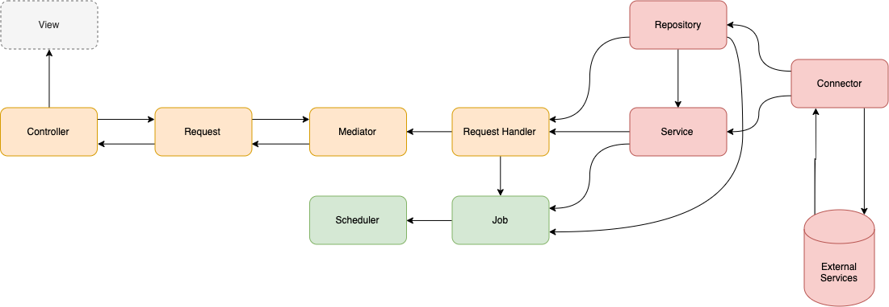
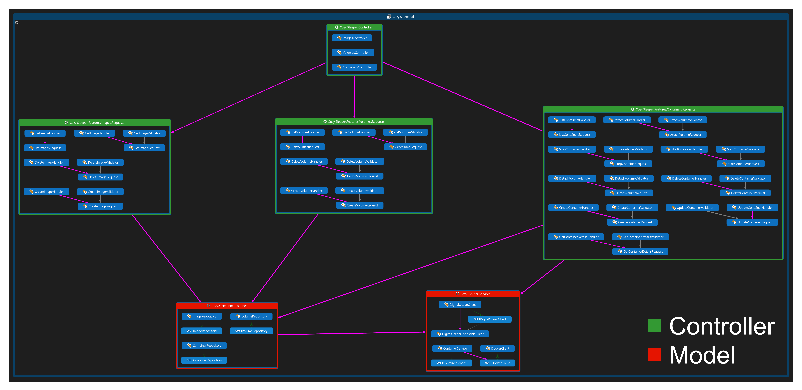
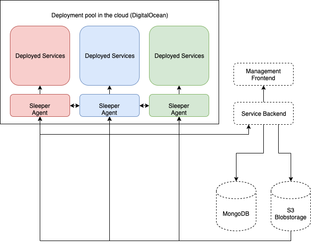

# Cozy - Software Architecture Document

Version 1.0

## Table of Contents

- [Cozy - Software Architecture Document](#cozy---software-architecture-document)
  - [Table of Contents](#table-of-contents)
  - [1. Introduction](#1-introduction)
    - [1.1 Purpose](#11-purpose)
    - [1.2 Scope](#12-scope)
    - [1.3 Definitions, Acronyms and Abbreviations](#13-definitions-acronyms-and-abbreviations)
    - [1.4 References](#14-references)
    - [1.5 Overview](#15-overview)
  - [2. Architectural Representation](#2-architectural-representation)
  - [3. Architectural Goals And Constraints](#3-architectural-goals-and-constraints)
  - [4. Use-Case View](#4-use-case-view)
  - [5. Logical View](#5-logical-view)
    - [5.1 Overview](#51-overview)
    - [5.2 Architecturally Significant Design Packages](#52-architecturally-significant-design-packages)
  - [6. Process View](#6-process-view)
  - [7. Deployment View](#7-deployment-view)
  - [8. Implementation View](#8-implementation-view)
  - [9. Data View](#9-data-view)
  - [10. Size and Performance](#10-size-and-performance)
  - [11. Quality/Metrics](#11-qualitymetrics)
  - [12. Patterns](#12-patterns)

## 1. Introduction

### 1.1 Purpose

The purpose of this document is to layout the architecture of the Cozy service, or more specific the agent component, which deploys the user-created services to machines in the cloud and manages the service from a low-level standpoint.

### 1.2 Scope

The scope of this document as of now is concentrated on the agent.However other components that do not exists as of yet are displayed in certain diagrams of this document, as they will be used in production.

### 1.3 Definitions, Acronyms and Abbreviations

| Abbreviation | Description                            |
| ------------ | -------------------------------------- |
| API          | Application programming interface      |
| MVC          | Model View Controller                  |
| REST         | Representational state transfer        |
| SDK          | Software development kit               |
| SRS          | Software Requirements Specification    |
| UC           | Use Case                               |
| VCS          | Version Control System                 |
| N/A          | Not Applicable                         |

### 1.4 References

N/A

### 1.5 Overview

N/A

## 2. Architectural Representation

This diagram represents the general architecture of the agent application. In terms of a Model View Controller architecture, classic componenets like the View or a controller can be found. However the represented View exists as theoretical concept and in reality is never touched by the developer, since the agent is just a backend application and only offers REST endpoints. So the View really is the JSON parser and thus explicit Views do not have to be created. The Controller simply decides what to display and the parser does pretty much the rest. In addition to that the Model logic is broken down into a few modular components. We also consider our dependencies (other REST APIs) as external services. The aforementioned components consits of Repositories, Services and Connectors. The Connectors establish an abstract way to interact with certain dependencies in the way that only a fraction has to be rewritten, when a different service should be integrated or a complete switch to a different service provider has to be made. This scheme carries over to the Repositories and Services. Repositories offer CRUD functionality on entities of the services, whilst Services can provide more complex interactions with a service provider. They are also able to use the CRUD operations provided by a Repository. In order to keep the controller logic as clean as possible a Mediator is set in between the Controller and the Model logic. The Controller thus only has the sole task of handing over Request to the Mediator and presenting the received response. A Requests defines either a query (look up data) or a command (modify data) that should be executed on the Model and has a corresponding Handler that executes the Task with the given input. It then carries out the transactions on the Repository or Service. In addition to that Jobs can be handed over to a Scheduler for recuring or delayed execution parallel to the Request. This concept is needed, since some services only alow subsequent executions once a entity is created and also will be used in future for scheduled maintenance of the service. The Job also can access all of the Model logic in oder to perform transactions.

## 3. Architectural Goals And Constraints

- Architecture that does not compromize on performance
- Clean and extensible architecture that is future prove and scales well
- Architecture that encourages testing of individual components
- Observable architecture that allows for minimal and if short maintange periods

Since the architecture is well proven even prior to this project, no constraints have been encountered as of now during development.

## 4. Use-Case View

## 5. Logical View

### 5.1 Overview

For the overview you can take a look at our class diagramm in the [Blogpost #8](https://blog.cozy.gg/class-diagram/)

Here is a shortened version that is structured and marked with the individual MVC reions:

We not agreed yet, which dependencies will be need for our cozy-project. So you have to keep up.
The only dependency we now have is a up-to-date Docker Client. But this will also be eliminated soon.

### 5.2 Architecturally Significant Design Packages

As we just provide backend functionality with a swagger "frontend" to test the RestAPI at this point, we can just talk about these Design Packages.

We have different end-points to access the different functions like "/container, /images/, /volumes..."

Also the Dependency Injection with a local Docker Client is working as you can see in the class diagramm.

## 6. Process View

N/A

## 7. Deployment View

The diagram aboave displays the current plans for deployment in production. The components with a dashed outline do not exist yet. Components in the deployment pool of same color are the same machines. Deployments now works in the way that a single agent has to exist at first. From this first node in the cluster other nodes can be deployed. The nodes on first startup send a "hello" message to the service backend and propagate theier existence. The agent itself then deploys services to the specific machine in the cloud. Images for the creation of the services can be pulled and built from a connected S3 storage endpoint or other external solutions (ex. Docker Hub). As of now the deployment pool will be hosted on DigitalOcean, but other Providers can be integrated once they are required.

## 8. Implementation View

N/A

## 9. Data View

N/A

## 10. Size and Performance

Due to limited memory on the machines (in the cloud), the program should be as small and performant as possible.

## 11. Quality/Metrics

To ensure good quality we've written test cases for creating, deleting, starting and stopping services.

## 12. Patterns

- MVC - Classic Modal View Controller architecture for separating concerns of the application
- Mediator pattern - The mediator handles interaction via request between components of the model and controller. It fetches or requests changes on Services and Repositories of the application.
- Repositories - Abstracts CRUD functionality for a specific external dependency (WebAPI, Database). Allow for easy switching between different external dependencies.
- Services - Abstracts more complex functionality for a specific external dependency than a Repository does. Same benefits as with the Repository
