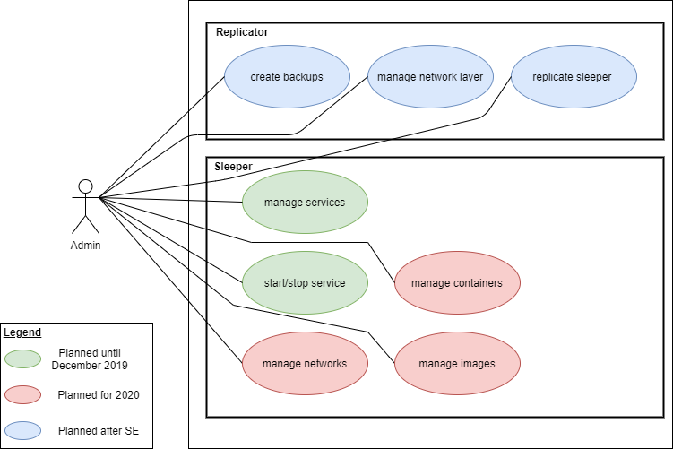

# Requirements

**Cozy**
Software Requirements Specification
Version 0.0.1

## Table of Contents

1. Introduction
   1. Purpose
   2. Scope
   3. Definitions, Acronyms and Abbreviations
   4. References
   5. Overview
2. Overall Description
3. Specific Requirements
    1. Functionality
    2. Usability
    3. Reliability
    4. Perfomance
    5. Supportability
    6. Design Constraints
    7. On-line User Documentation and Help System Requirements
    8. Purchased Components
    9. Interfaces
       1. User Interfaces
       2. Hardware Interfaces
       3. Software Interfaces
       4. Communications Interfaces
    10. Licensing Requirements
    11. Legal, Copyright, and Other Notices
    12. Applicable Standards
4. Supporting Information

## Software Requirements Specification

### 1. Introduction

### 1.1 Purpose

This SRS runs through all of the specifications for Cozy in general and its sub-systems. Cozy is a hosting platform building on top of containerized services running in Docker. The service allows its users to create and manage hosted services in the cloud (with a focus on game servers), without needing the necessary know-how of hosting a server or the Docker platform.

### 1.2 Scope

The specification covers the whole service with all its components

### 1.3 Definitions, Acronyms and Abbreviations

(tba)

### 1.4 References

(tba)

### 1.5 Overview

The following paragraphs describe the project, as well as the vision of the team regarding the service being developed.

### 2. Overall Description

### 2.1 Product Vision

Please refer to the following [introductory](https://blog.cozy.gg/introduction/) blog post for detailed information about the project’s vision. Also have a look at the folowing use case diagram for a graphical representation of the functionality the service is going to offer.

### 2.2 Product Perspective

(tbd)

### 3. Specific Requirements

### 3.1 Functionality

### 3.1.1 Deployment Agent

The agent represents the lowest interaction-layer of the service and manages the interaction wit docker and the backend application. It is deployed to the individual nodes of a Docker cluster and exposes endpoints for interaction via REST.

#### Create Images from a Dockerfile (Container templates)

The agent offers a REST endpoint for the creation of Docker images from a URL to a Dockerfile within the payload. The URL can be any Dockerfile hosted anywhere.

#### Remove Images from the Docker host

The agent offers a REST endpoint to remove unused Docker images. Sort of a garbage collection mechanism to keep the host clean. This could also be run in a scheduled task.

#### Create Volumes

The agent offers a REST endpoint to create Docker volumes via a provided payload.

#### Delete Volumes

The agent offers a REST endpoint to remove user created Docker volumes form the host via the identifier in the payload.

#### Create container

The agent offers a REST endpoint to create Docker containers via a provided payload offering access to a Docker image identifier previously created via the image creation endpoint.

#### Update container

The agent offers a REST endpoint to update the name and description label of a already deployed container.

#### Attach volumes

The agent offers a REST endpoint to mount volumes in a container via a provided mount path and the volume identifier in the payload.

#### Start container

The agent offers a REST endpoint to start a container.

### Stop container

The agent offers a REST endpoint to stop a container.

### 3.1.2 Service management backend

The management backend represents the interaction-layer between the frontend, the database and the deployment agent. It offers REST endpoint for customer related interactions, such as: User creation & management, service administration and deployment scheduling.

(Further, detailed specification once the agent is ready)

### 3.1.3 Customer & administration frontend

The customer and administration frontend represents the highest interaction-level and is the mediator between the user and the service. It offers a user interface for both customers, that use the service, as well as the administrators that maintain it.

(Further, detailed specification once the agent is ready)

### 3.2 Usability

Usability is a main concern of the service, since it wants to offer a task not every user is capable of handling. Thus a great experience must be provided to any user be it a newcomer to the technology or an experienced professional.

### 3.2.1 Services can be accessed from the web

The customer using the service should be able to access its services through the browser. The main concern is to at least offer a usable experience for the modern browsers (further specification of "modern" to be determined). Users of older browsers are offered to download one of the modern ones.

### 3.2.2 User interface should be accessible to anyone

The frontends user interface is required to be accessible to any user group, no matter of the previous experience in regard to cloud services or managing Docker services. There should be offerings for more experienced power users though. The user interface should thus be far from complex and should invite the user to use the service, or at least give it a try.

### 3.2.3 No in-depth training required

As already layed out from a user interface perspective in 3.2.2, the user should not have to rely on in-depth documentation to use the service. It must be understandable from the get go what the purpose of the service is and how to get started. This does not mean however that no documentation must be provided at all. The most important goal here is to have the user up and running in a few minutes with their first bare bones service.

### 3.3 Reliability

Reliability is a key part of the user experience. In general this means the service must function in a way, that the user does not notice any downtimes or be degraded in its abilities to use the offerings delivered by the service.

### 3.3.1 Service availability

The service relies on cloud providers to host its components. Most cloud providers offer a availability of close to 99.9% of the year. This however does not account for eventual downtimes caused by a first-party service of ours failing. In these cases the Docker infrastructure comes into place and tries to recover services that fail as well as redeploy previous versions and manage scaling of the different services based on load. Even there are such fallbacks in place at least one day per month should be taken into account for maintenance and unpredictable outages of the service. The offered calculated availability rate thus comes in at 96.6% of the year.

### 3.3.2 Mean time between failures

In the case of failure the time between a other problem occuring should be as low as possible. The service is required to be at least online for another 24 hours until further downtime is acceptable.

### 3.3.3 Mean time to repair

The service is in general and given from the calculation provided in 3.3.1 allowed to have a total downtime of 24 hours per month, thus the mean time to repair is at maximum the same as the allowed downtime per month.

### 3.4 Performance

Performance also is a key value for delivering a great user experience and has major impacts on the users ability to use the service in a comfortable way. Therefor the performance of the service has to be on point and the user should not notice any slowdowns or other kinds of bottelnecks to the user experience.

### 3.4.1 Response time

There are no explicit limitations in regards to response time given as of now, though the general concern is that te application behaves fluently to the end-user and thus responstimes that break this guideline are unacceptable.

### 3.4.2 Throughput

Since the service can scale through the usage of Docker and clustering of the service a high throughput can always be achieved and maintained. A explicit number can not be given currently since there is no calculation as of yet on how much transactions per second are needed to maintain a fluent behavior of the service. The guideline in this case is the same as given in 3.4.1.

### 3.4.3 Degradation modes

The service should allways no matter what failure at least maintain the user created services and allow access to them. It is acceptable if the management interface is unavailable at some point, since there is just a limitation in configuration and management, but not in general availability of the crucial part the service offers.

### 3.4.4 Resource utilization

Resource utilization of the service as well as the user created services should be kept at a minimum, to ensure that there is allways a spot ready for provisioning a nother service if needed. Since the service can scale to a different node in the cluster resources are not a critical concern but should be monitored to ensure that there is no resource waste.

### 3.5 Supportability

### 3.5.1 Coding Conventions C

To stay with a clean, easy readable and understandable coding-style we enhance our project with [this](https://github.com/medialesson/cc-todolist/projects/1) coding conventions. As a team we wanted to keep our conventions simple as possible. For more informations visit the given git repo. or our [workflow](https://github.com/Boxwrapper/cozy/blob/master/workflow.md) under 'Code Conventions'.
As our conventions are very simpel we are ready not to follow these conventions continous.

### 3.5.2 Language Conventions

Our project will be available in the early phase only in the english language.
But German is also an open point for discussion.

### 3.5.3 System Conventions

Our project will be accessible on any device with any kind of OS.
Also the project will be build on Windows and MacOS.

### 3.5.4 Commit Conventions

To keep our github repository readable we are using the [gitmoji cli](https://github.com/carloscuesta/gitmoji-cli). To read more about it check out are [workflow](https://github.com/Boxwrapper/cozy/blob/master/workflow.md) document

### 3.6 Design Constraints

### 3.6.1 Software languages

#### 3.6.1a Backend

In order of accessibility of Docker in C# with the [DotNet API](https://github.com/microsoft/Docker.DotNet) we provided our project with ASP .NET Core.

#### 3.6.1b Frontend

Because we want to be very user-friendly and provide a cozy website we use React for the Frontend. Also some people of the team have knowledge about React.

### 3.6.2 Github

Mainly used for version-managing and to keep our files ranging between every team member.

### 3.6.3 Integrated Development Environment

As a team we agreed on two IDE's:

- Visual Studio Code \[offers a great area of access to C# and JavaScript. Also has a GitHub extension.\]
- Visual Studio \(prefferably with ReSharper\) \[offers a great area of access to ASP .NET Core and includes GitHub\]

### Clockify

We needed any type of time-managing tool, we agreed on Clockify, because it's free :tada:.

### 3.7 On-line User Documentation and Help System Requirements

The documentation of the project takes place on our blog.
The application is developed as intuitively as possible, but if a user has a question about the usage or a problem, there is the possibility to send a support request.
These can then be answered by the admin. An optional possibility to answer questions would be a bot.  This will only be implemented if there is enough time left.

### 3.8 Purchased Components

(tbd)

### 3.9 Interfaces

This section defines the interfaces that must be supported by the application.

### 3.9.1 User Interfaces

The Application will feature a Frontend for the User to interact with their services, manage their account/billing and chat with support. Cozys Frontend is realised as a Web-App using ASP.Net Core and React. There will also be an area specifically designed for administration where only staff member have access and can for example manage user accounts, respond to support tickets and control the Docker Swarm.

### 3.9.2 Hardware Interfaces

N/A

### 3.9.3 Software Interfaces

At the Heart of Cozy lies the Backend "Sleeper" Agent which can be interacted with using a REST Api and JSON payloads. Communication with Docker happens using the Docker API which is exposed via an Unix Socket on the local machine. External Software-Interfaces consist of different OAuth2 Service Providers like Google/Microsoft and Payment Gateways (e.g. Braintree)

### 3.9.4 Communications Interfaces

N/A

### 3.10 Licensing Requirements

(tbd)

### 3.11 Legal, Copyright, and Other Notices

(tbd)

### 3.12 Applicable Standards

(tbd)

### 4. Supporting Information

(tba)
