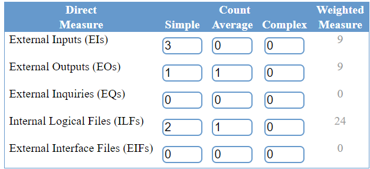
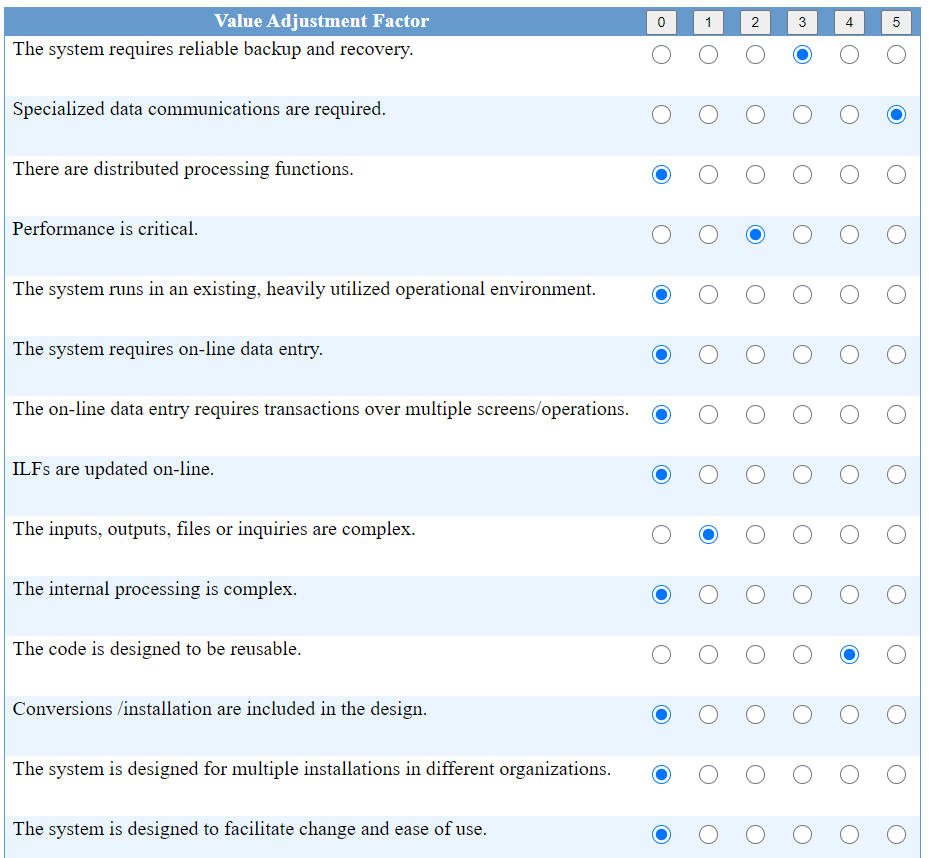

# Cozy - Use-Case Specification: Manage Services

## 1. Use-Case Name

Manage images.

### 1.1 Brief Description

Create, update and delete images.

## 2. Flow of Events

### 2.1 Basic Flow

### 2.2 Alternative Flow

(n/a)

## 3. Special Requirements

There are no special requirements needed for this use case.

## 4. Preconditions

User has to have administrator rights.

## 5. Postconditions

There are no postconditions for this use case.

## 6. Function Points

**Score:** 42 * 0.8 = 34

