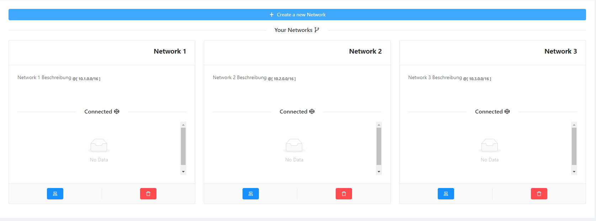
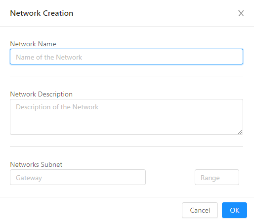
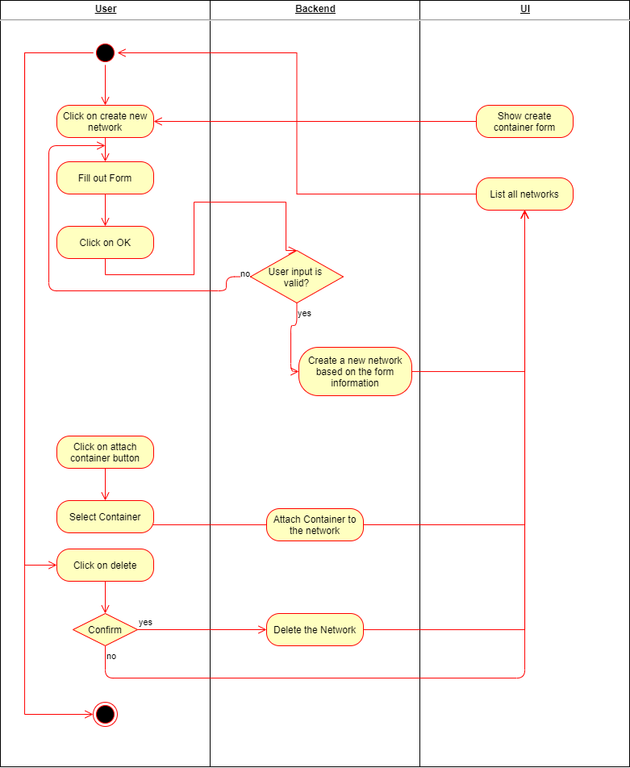
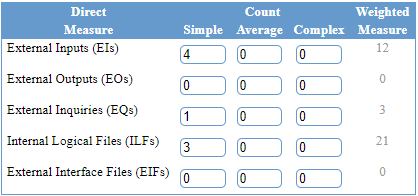

# Cozy - Use-Case Specification: Manage Networks

## 1. Use-Case Name

Manage Networks

### 1.1 Brief Description

The user is able to create, configure and delete a network. Container can be attached on a created network afterwards.

### 1.2 Mockup
#### 1.2.1 List Networks


#### 1.2.2 Create Network form



## 2. Flow of Events

### 2.1 Basic Flow




```Gherkin
Feature: Create Network

	Scenario: Create Network
		Given user is logged in
		And user is on list network page
		When user clicks create new network
		Then the network form should be displayed
		When the user fills out the form 
		Then clicks on okay
		Then network should be setup
		And updated list service page should be displayed

```


### 2.2 Alternative Flow

(n/a)

## 3. Special Requirements

There are no special requirements needed for this use case.

## 4. Preconditions

The admin has to be logged in.

## 5. Postconditions

There are no postconditions for this Use-Case.

## 6. Function Points

**Score:** 36 FP * 0,84 = 30FP  
**Time Spent**: 



