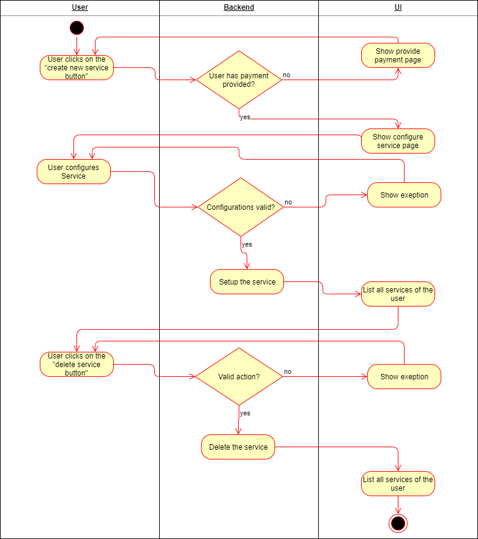
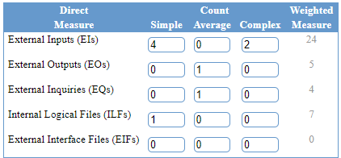
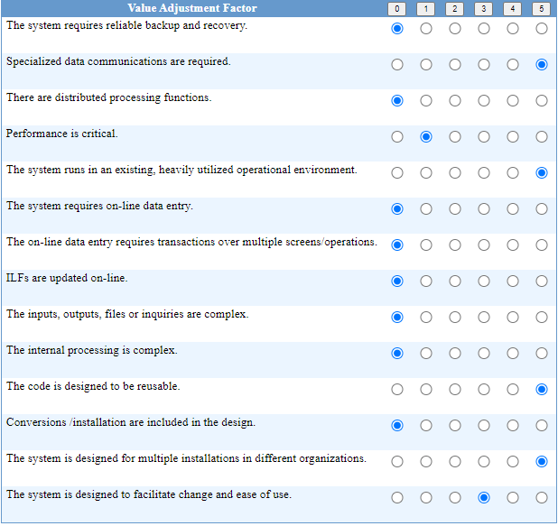

# Cozy - Use-Case Specification: Manage Services

## 1. Use-Case Name

Manage Services

### 1.1 Brief Description

The user is able to create, configure and delete a service. After the creation and configuration the service is ready to use.
These functionalities and the deleting can be managed on the service-overview page. On this page are all services listed.

## 2. Flow of Events

### 2.1 Basic Flow



```Gherkin
Feature: Create Services

	Scenario: Create Service
		Given user is logged in
		And user is on list services page
		When user provides payment
		And user provides a correct service configurations
		When user clicks create new service
		Then service should be setup
		And updated list service page should be displayed

	Scenario: No payment provided
		Given user is logged in
		And user is on list services page
		When user provided no payment method
		When user clicks create new service
		Then user should be redirected to the provide payment page

	Scenario: Configuration is invalid
		Given user is logged in
		And user is on configure service page
		When user provides a incorrect configuration
		And user clicks on create
		Then an error message should be displayed
		And service should not be set up
```

```Gherkin
Feature: Delete Services

	Scenario: Delete Service
		Given user is logged in
		And user is on list services page
		When clicks on delete service
		And service was created by the user
		Then service should be deleted
		And updated list service page should be displayed

	Scenario: User has no permission to delete
		Given user is logged in
		And user is on list services page
		When clicks on delete service
		Then service should be not deleted
		And error page should be displayed
```

### 2.2 Alternative Flow

(n/a)

## 3. Special Requirements

There are no special requirements needed for this use case.

## 4. Preconditions

The registered user has to be logged in and has already provided a payment method.

## 5. Postconditions

There are no postconditions for this Use-Case.

## 6. Function Points

**Score:** 40 FP * 0,89 = 35.6FP  
**Time Spent**: 





