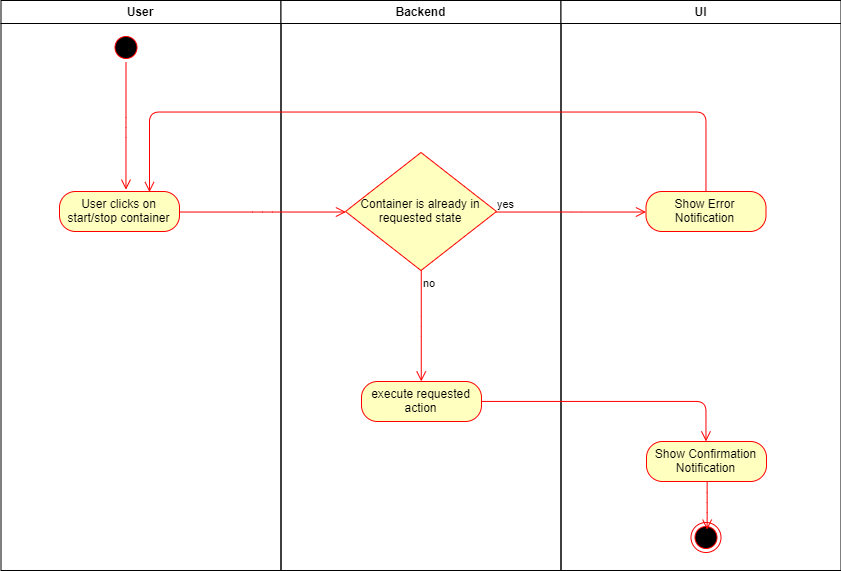
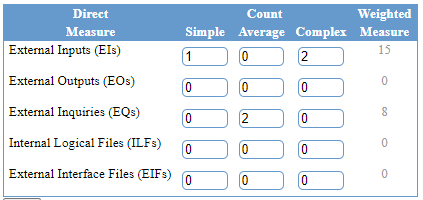

# Cozy - Use-Case Specification

## 1. Use-Case Name

Start or Stop a container

### 1.1 Brief Description

A User is able to Start a Service-Container at any time if it is needed and can Stop it again afterwards.

### 1.2 Mockup

n/a

## 2. Flow of Events

### 2.1 Basic Flow

```Gherkin
Feature: Start/stop services

	Scenario: Start/stop service
		Given user is logged in
		And user is on list services page
		When user clicks start/stop container
		And container is in the right requested state
		Then service should started/stopped
		And confirmation notification should be displayed

	Scenario: Container is in the wrong state
		Given user is logged in
		And user is on list services page
		When user clicks start/stop container
		And container is in the wrong state
		Then error should be displayed
```

### 2.2 Alternative Flow

n/a

## 3. Special Requirements

There are no special requirements needed for this use case.

## 4. Preconditions

To be able to execute these action, a user has to be registered/logged in and needs to have a service configured

## 5. Postconditions

n/a

## 6. Function Points

**Score:** 23 FP * 0,89 = 35.6FP  
**Time Spent**: 




