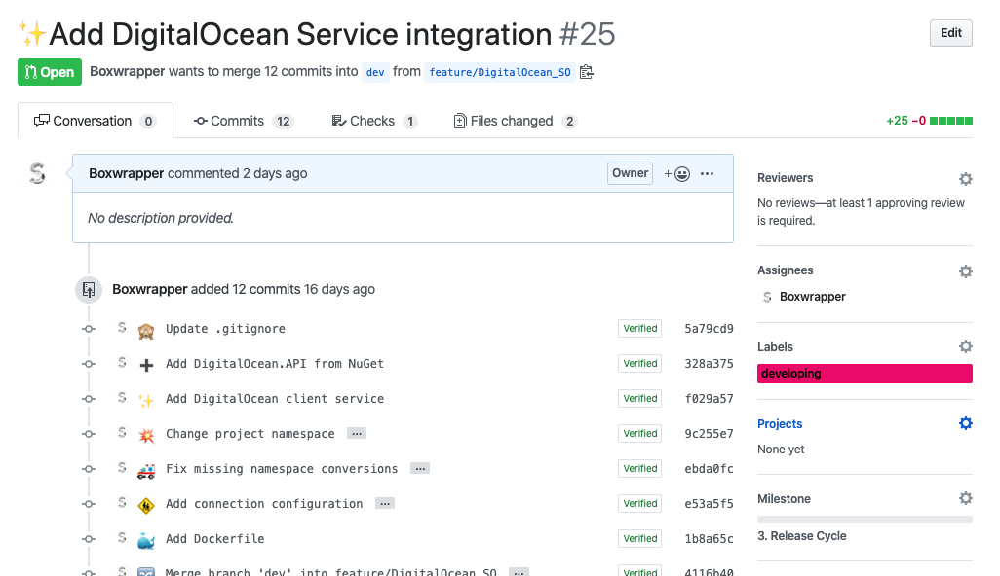
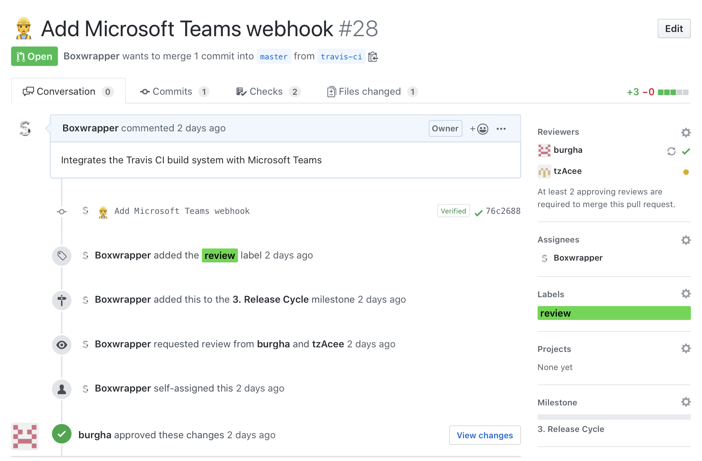

# Workflow

This document lays out the workflow we are using regarding our organization of the GitHub repository and Code style principals. Make sure to read through the **whole** document and ask other collaborators for help if there is something that you do not understand. These guidelines are mandatory for a structured project and great usability for all team members and thus must be followed by **everyone** on the team!

Amendments made to this document in future apply as of the time they are added. So make sure to regularly check this document in order for you to implement the changes made into your personal workflow.

## Contributing

If you want to make a change about the conventions explained in this document or have something that you think needs to be added, simply checkout a branch and make changes to the file. Once done open a pull request targeting the `master` branch and add the `documentation` label.

## Features

### Requesting a feature

Feature requests can be done using GitHub Issuses. If you want to request a new feature, simply open up an Issue with a title according to the requested feature. Make sure to give at least a brief summary about the feature. - The more detail, the better. If your able to develop the feature yourself have a look at the [feature development][1] section, otherwise wait until the feature is approved by someone from the development team. Once the feature is approved it will be added to our backlog and scheduled for development as soon as possible. Please make sure to check the request section at first before submitting duplicate, or already rejected features. Just because your feature is rejected by the development team, does not mean that the feature should not be implemented. Your always free to develop it yourself and submit it via a Pull Request. It is just not possible to develop the feature in-house at the time.

### Developing a feature

Once you have been assigned, or assigned yourself to developing a requested feature, the first step regarding the development is to checkout a feature branch. The feature branch must correspond to the following naming scheme: `feature/[FeatureName]_[YourInitials]`. So lets suppose you are developing a Database connector for MongoDB. In this case your feature branch would be called:

`feature/MonogDBConnector_MM` (Max Mustermann)

Once you have checked out your development branch locally, make sure to publish it at the origin on GitHub. Next it is time to open up a Pull Request on GitHub for your newly created feature, targeting the `dev` branch. This proccess assign's the feature a unique id that is further used for tracking the progress of the feature on our taskboard. It furthermore allows us to switch the taskboard in future without loosing all tasks from the past. Make sure to add the `developing` label to your Pull Request and assign it to yourself. If the feature has a due date make sure to add the according milestone as well. A fitting title for the Pull Request should also be chosen at this point. The title should follow the characteristics of a commit message, since it will be used as such, once the feature is merged. Further details about writing usefull commit messages can be found in the [commit messages][2] section.

Your feature should now look something like this:

For consitency between the taskboard and GitHub make sure to assign the Pull Request's id to the title of the task on the board. If none existent, make sure to create it and also assign it to yourself. This is only needed for members of the core development team. Community development is as of now not tracked on the taskboard.

### Submitting a feature

Once you are done developing a feature according to the specification or request given, you should submit your feature for review. In order to let all contributors know, that your feature is ready for a review, add the `review` tag to your Pull Request. First step in the review process are some automated checks. These checks should already be completed successfully, since they run during development, everytime a commit is made. The requirements for a successfull pass of these checks are: The changes musst pass the automatic build via Travis CI and must validate against all code style checks on Codacy. Once these are completed and your Pull Request has a green checkmark, a reviewer will assign the Pull Request to themselves for further review of your changes. This ensures that your code is not only compliant in an automated scenario, but is also checked and approved by a human. The reviewer can then approve or reject your Pull Request. In the case of aproval your feature is ready for merge ands wil be labeled `done`, otherwise the reviewer has to request further changes through the GitHub review functionality and mark the Pull Request again with a `developing` label. Once your done implementing the requested changes a new review is requested.

Once you give up your Pull Request for review, it should look something like this:

### Merging a feature

Once your Pull Request has been approved by the set amount of reviewers and went trough the automatic review process, your feature is ready for merge into the current development progress. Your Pull Requests label will have changed to `done`, by a reviewer. The only thing left to do is to manually merge the request and delete the source branch on the origin. The merge will automatically close your Pull Request. Now its time for a new Feature!

After the review process your Pull Request should look something like this:

## Commit messages

Commit messages are a key thing when working with git. They let contriobuters know at a glance, what you changed during your development of a feature, or documentation. It is essential to get them right, so that the above statement is always applicable for everyone working on the project. There are some key aspects that every contributors should follow, when writing commit messages:

- Write in present tense
- Summarize in a maximum of 50 characters

Following these ciretearia will fulfill the request given for a commit message. It is essential for reviewers to keep track of commit messages and point out mistakes made by the contributors, so that everyone can be sure, that the quality is up to the given standard once the feature is merged into `dev`. In addition to these, the project team decided to implement the Gitmoji pattern for commit messages early on. This means that every commit message must be prefixed with a corresponding Emoji, for further at a glance information  about the commit. For further details on Gitmoji have a look at [this](https://gitmoji.carloscuesta.me/) guide. The following example furthermore provides you with some example commit messages:

- `🍱 Update asset files for media player`
- `🚧 Add work in progress configuration helper`
- `🙈 Update .gitignore`

### Code conventions

This section simply names a few paradigms you should make use of during development. These are recommendations for achieving structured and clean code. Try to follow them as far as possible. Alsoways make sure to comment on things that are not up to standard, so that other contributors can improve these sections in future.

- KISS — Keep it simple, stupid
- DRY — Don’t repeat yourself
- YAGNI — You ain’t gonna need it
- SOLID — Set of paradigms in OOP programming

Further reading on the mentioned conventions / paradigms can be found in [this](https://clean-code-developer.de/) guide on clean code development. For an example in code have a look at the example provided in [this](https://github.com/medialesson/cc-todolist) repository, created for a presentation on clean code.

[1]: #developing-a-feature
[2]: #commit-messages
